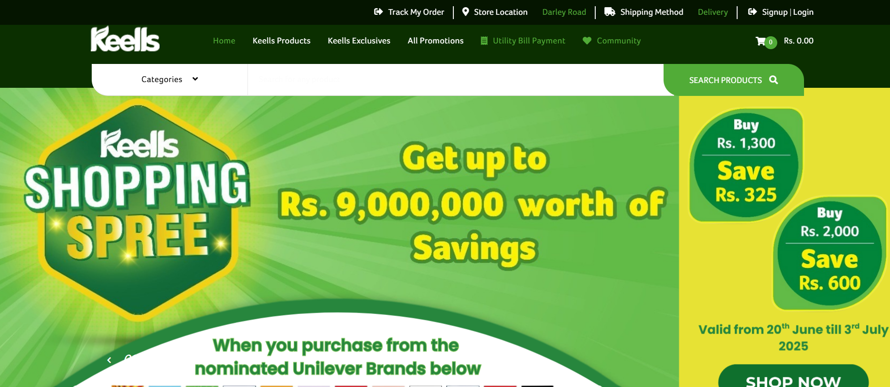
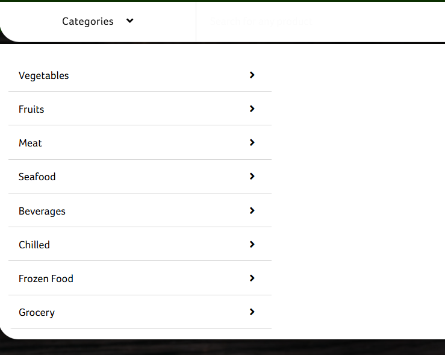
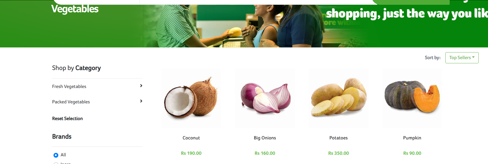

# webscrape_bs4_keels
keels site scrape (2025/06/25)

# 🛒 Keells Supermarket Product Scraper

This Python script scrapes product information (e.g., name, price, image URL) from the [Keells Supermarket website](https://www.keellssuper.com/). It uses **Selenium** and **BeautifulSoup** to extract data from dynamically loaded content.

## 🔍 Features

- ✅ Supports scrolling to load all products on the page
- ✅ Extracts:
  - Product Name
  - Final Price
  - (Optional) Original Price
  - (Optional) Discount Percentage
  - Image URL
- ✅ Saves output to CSV
- ✅ Works on all category pages like:
  - Snacks
  - Fruits
  - Bakery
  - Electronics
  - Grocery
  - Household Essentials
  - Chilled Products

## 🖼 Screenshots

### 🏠 Homepage



### 📂 Category Page



### 🧃 Sample Category View



> 📁 Make sure to place your screenshots in a `screenshots/` folder for them to display correctly.

## 🧑‍💻 How to Run

### 1. Install Required Packages

```bash
pip install selenium beautifulsoup4 pandas


